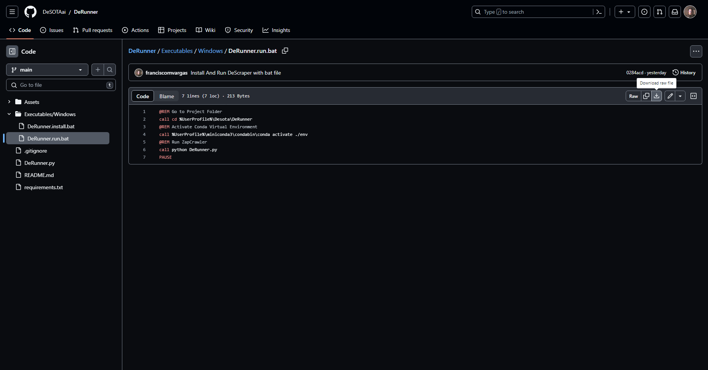
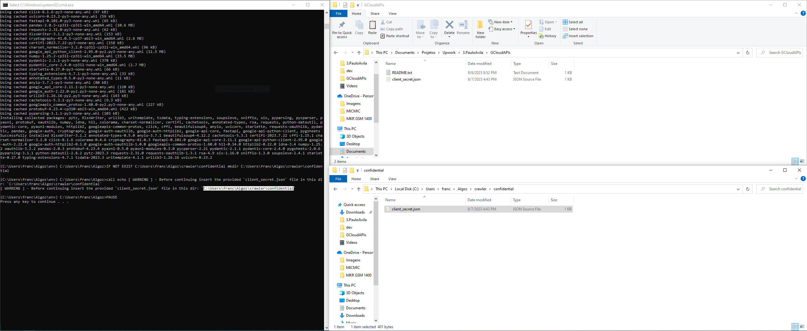
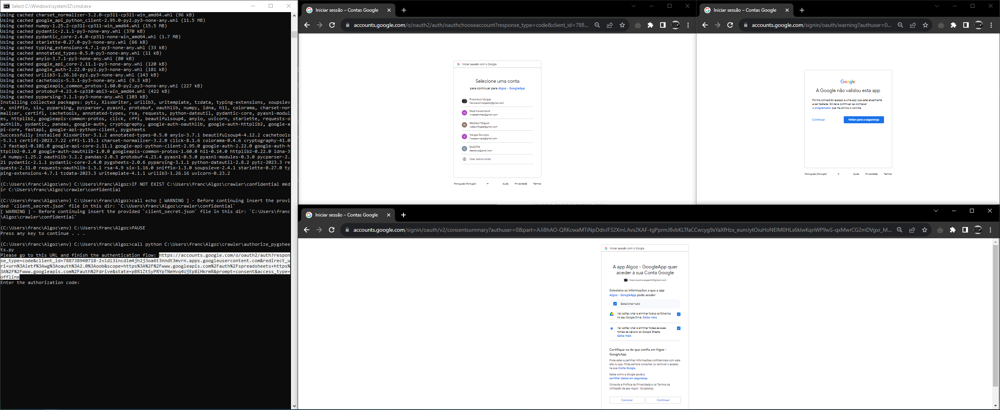
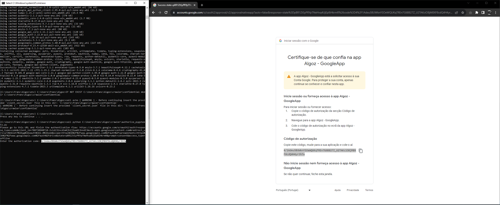
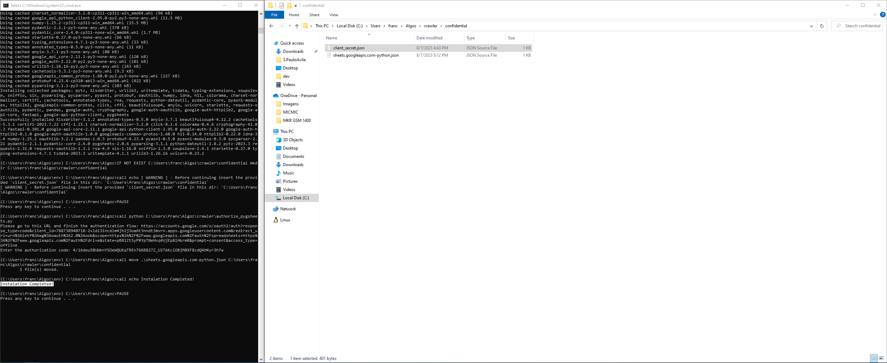

# Instalation

    
<h2>Windows</h2>

**Download and run:** [algoz.install.bat](https://github.com/pauloavila88/algoz/blob/dev/Executables/Windows/algoz.install.bat)

 * ***Tip:***
    * Run as Admnistrator to prevent Deneid Acess.

 * ***Google APIs Authorization:***
    * While instalation will be requested to insert Google Cloud APIs Credentials JSON file in a specific folder:

        

    * Authenticate the Google Sheets/Drive that will be associated with App:
        * Get Google APIs Authorization Code:

            

        * Set Google APIs Authorization Code:

            

* ***Instalation Completed:***

    

# Run

    
<h2>Windows</h2>

**Download and run:** [algoz.run.bat](https://github.com/pauloavila88/algoz/blob/dev/Executables/Windows/algoz.run.bat)

# Uninstall

    
<h2>Windows</h2>

**Download and run:** [algoz.uninstall.bat](https://github.com/pauloavila88/algoz/blob/dev/Executables/Windows/algoz.uninstall.bat)

